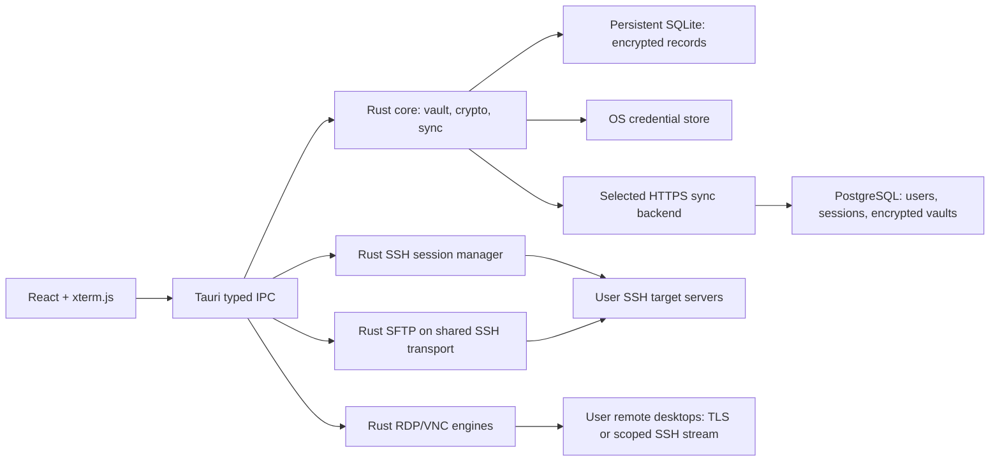

# SelfTerm Rust migratsiyasi: arxitektura va protokol

Sana: 2026-09-27. Status: implementatsiyadan oldin review qilinadigan taklif.
Baseline: `58e7c135343bde35c7385c4e0448498fcaa8b61f`, `electronjs` branch.

## 1. Talablar va qaror

Foydalanuvchining talabi: mavjud kodni GitHub’da saqlash, Electron versiyasini `electronjs` branchda qoldirish, Rustga o‘tishning aniq rejasini berish; Windows/Linux/macOS/Android/iOS va ham self-hosted, ham umumiy cloud backend.

Asosiy tavsiya: Tauri 2 shell, Rust domain/SSH/crypto/storage/sync, Rust Axum server, umumiy React/TypeScript/xterm.js UI. UI’ni to‘liq Rustga ko‘chirish talab etilsa bu spec qayta ko‘rib chiqiladi; Dioxus variantini ushbu scope’ga yashirincha qo‘shmaymiz.

Scope extension: [preserved UI/SFTP](2026-09-27-ui-workspace-sftp-design.md) va [RDP/VNC](2026-09-27-rdp-vnc-design.md). Bu specs yangi protocol/UI contractlari uchun authoritative; oldingi Host-only model E2 migration orqali kengayadi. Hozirgi Termiusga o‘xshash UI saqlanadi; yangi funksiyalar existing workspace’ga qo‘shiladi.

M0 faqat manba kodni saqlash va hujjatlar. Quyida tasvirlangan API, Rust fayllar va Docker paketlar hozircha mavjud emas.

## 2. Baseline auditi va parity

| Hozirgi joy | Vazifa | Yangi egasi |
| --- | --- | --- |
| `electron/main.cjs:getVaultPath/readVault/writeVault` | `userData/vault.json`, JSON storage | `crates/selfterm-core/src/storage.rs`, persistent SQLite |
| `normalizeHost`, `publicVault` | CRUD, password redaction | `domain.rs`, `public_view.rs` |
| `safeStorage` helpers | OS-bound password ciphertext | `secrets.rs` va platform adapter |
| `encryptedBlobFromVault` | scrypt + AES-256-GCM, v1 | `legacy.rs`; yangi writes `crypto.rs` v2 |
| `sync:push`, `sync:pull` | Manual host snapshot push/pull | `sync.rs`, versioned API |
| `ssh:*` handlers | ssh2 sessions, input/output/resize | `crates/selfterm-ssh` va Tauri commands |
| `electron/preload.cjs` | `window.selfterm` bridge | `apps/client/src/platform/api.ts` |
| `src/App.jsx` | Hosts/groups/search/tabs/history/dialogs/settings | `apps/client/src/features/*` |
| `src/main.jsx`, `styles.css` | Fonts, themes, layout | Client frontend; desktop parity, mobile adaptations |
| `server/server.js` | Token, `/health`, global `/vault` | `apps/server`, per-user Postgres |
| `package.json`, `vite.config.js` | Electron/Vite/Linux packaging | Workspace frontend + Tauri build + platform CI |

Auditorlik topilmalari:

1. `README.md` passwords saqlanmaydi deydi; kod esa optional `safeStorage` bilan saqlaydi. Migratsiya hujjatlari koddagi haqiqiy xulqni asos qiladi.
2. Lokal JSON profillar va sync token uchun to‘liq vault encryption yo‘q; password maydoni alohida himoyalangan.
3. V1 sync faqat `hosts`ni eksport qiladi; appearance/history sync emas. `keyPath` boshqa qurilmaga ko‘chsa ishlamasligi mumkin. `passwordSecret` boshqa OS/user keyring’ida ochilmaydi.
4. Server bitta shared token va `vault.json` ishlatadi. Akkaunt, tenant isolation, revision, CAS, quota, email verification yo‘q.
5. Client SSH config’da aniq host-key verification handler yo‘q. Yangi SSH implementation bu invariantni majburiy qiladi.
6. `readVault` JSON xatosida default vault yozishi mumkin. Yangi storage corrupt file’ni almashtirmaydi.
7. SSH har data chunk’ni UTF-8 stringga alohida aylantiradi. Split UTF-8 sequences uchun yangi transport raw bytes bo‘ladi.
8. `App.jsx` 1613 va CSS 2030 qator; feature chegaralari ajratiladi, desktop UX qayta dizayn qilinmaydi.
9. Build va syntax/sync smoke tekshirildi; avtomatlashtirilgan SSH/security test suite mavjud emas. `lint` script bor, lekin repo ESLint konfiguratsiyasi/dependency’si yo‘q.

Parity: host CRUD, label/hostname/port/username/group/color/notes, password/key/desktop agent, terminal tabs, resize, themes/fonts/sizes/colors, saved-password opt-in, 100 ta successful-connection history, offline local access. History connection shell ochilgandan keyin yoziladi. Session credentials UI state’da doimiy saqlanmaydi.

## 3. Chegaralar va data flow



Client ichidagi Rust backend va internetdagi Rust server ikki alohida executable/context. Clientga internet server o‘rnatish shart emas. Sync serverda SSH target credentials, SSH sockets yoki terminal output bo‘lmaydi. Server Rust SSH crate’ga dependency olmaydi.

Instance/account almashtirishda lokal vault va known-hosts yo‘qolmaydi. Oldingi token yangi URL’ga yuborilmaydi. Birinchi release’da bir paytning o‘zida bitta sync binding; boshqa instance’ga ko‘chirish unlock, explicit destination choice va import orqali bajariladi, avtomatik eski remote vault’ni overwrite qilmaydi.

## 4. Global constraints

- Brand: SelfTerm; rename uchun alohida owner qarori.
- Runtime: Rust core/server; Tauri 2 + React/TypeScript/xterm.js UI; Electron/Node.js runtime yangi clientga kirmaydi.
- Targets: Windows x64, Linux x64, macOS x64/arm64, Android arm64, iOS arm64.
- Proposed product floors: Windows 10 22H2, Ubuntu 22.04/24.04 va Fedora current supported release, macOS 13, Android 10/API 29, iOS 16. M1’da library va device dalillari bilan tasdiqlanadi; tasdiqsiz past versiya qo‘llab-quvvatlanishi va’da qilinmaydi.
- Rust stable toolchain M1’da tekshirilgan aniq version bilan pin; Cargo.lock va package-lock.json tracked. Tauri 2.x pinned compatible dependencies; crates upgrade faqat CI orqali.
- Local-only account/backend’siz ishlaydi. Cloud va self-hosted bir xil image/API; Postgres yagona server DB engine.
- Client storage: persistent on-device SQLite, embedded in Rust; local HTTP server yoki local PostgreSQL talab qilinmaydi.
- Bundled SQLite version >=3.51.3; M1’da aniq patched version pin qilinadi va `sqlite_version()` bilan CI’da tekshiriladi.
- Protocol: `/v1`, payload `selfterm-vault-v2`, SHA-256 SSH fingerprints, ISO8601 UTC server audit timestamps; client wall-clock conflict resolution uchun ishlatilmaydi.
- No plaintext vault/SSH credentials/private keys in server, logs, backups, frontend persistence or Git.
- No semantic hardcoding. Search hozir oddiy deterministic local substring filter; AI/RAG qo‘shilsa berilgan engineering rules amal qiladi.
- V1 faqat import/read compatibility; yangi v1 writes va unattended destructive replacement yo‘q.
- Unknown SSH host requires explicit fingerprint acceptance; changed key blocks connection.
- Losing every unlocked device, passphrase and recovery key means encrypted data is unrecoverable; account password reset alone does not decrypt it.
- Mobil background execution va IP-change session survival kafolatlanmaydi; Mosh/relay scope’da yo‘q.

## 5. Repo va modullar

```text
Cargo.toml                    # Rust workspace (kelajakda)
Cargo.lock
rust-toolchain.toml
crates/
  selfterm-core/src/           # domain, public_view, crypto, storage,
                              # secrets, legacy, sync, error
  selfterm-protocol/src/       # auth DTO, vault envelope, errors, API schema
  selfterm-ssh/src/            # auth, host_keys, sessions, transport
  selfterm-sftp/src/           # browser, transfers, safe commit, editor
  selfterm-rdp/src/            # RDP TLS/NLA/session
  selfterm-vnc/src/            # RFB/security/decoder
  selfterm-remote-desktop/src/ # compositor, input, clipboard, lifecycle
apps/
  client/
    package.json
    src/platform/             # typed bridge + renderer byte acknowledgements
    src/features/             # hosts, terminal, history, settings, sync, unlock
    src-tauri/src/            # commands, state, plugins; thin Rust adapters
    src-tauri/capabilities/
    src-tauri/gen/            # native sources/configs tracked; output ignored
  server/src/                 # config, auth, devices, vaults, repo, limits,
                              # mail, admin, health, telemetry
  server/migrations/          # versioned PostgreSQL migrations
deploy/                       # Dockerfile, compose, Caddy, env examples
tests/fixtures/               # synthetic vaults/keys only
tests/e2e/                    # OpenSSH + PostgreSQL + two clients
.github/workflows/            # checks, package matrix, release, image
docs/                         # design, task plans, operators, validation
```

`selfterm-core` Tauri’ya bog‘lanmaydi; `selfterm-ssh` UI’ya bog‘lanmaydi; `selfterm-protocol` private vault plaintext modeliga bog‘lanmaydi. Server faqat public protocolga bog‘lanadi. UI backenddan redacted views oladi.

Server ushbu yangi protocol crates’ga dependency olmaydi. File contents, transfer bytes, clipboard va framebuffer client-target orasida; cloud/self-host sync faqat encrypted connection profiles. Device-local drafts/queue metadata SQLite’da encrypted, foydalanuvchi explicit download qilgan destination fayli esa tanlangan filesystemda odatdagi fayl.

## 6. Domain va local storage

Rust public type contractlari (`serde` DTO’lar camelCase; Rust fieldlar snake_case):

```rust
type HostId = uuid::Uuid;
type VaultId = uuid::Uuid;
type DeviceId = uuid::Uuid;
struct TerminalSize { cols: u16, rows: u16 }
enum AuthMethod { Password, ImportedKey, LocalKey, Agent }
struct Host {
    id: HostId, label: String, hostname: String, port: u16,
    username: String, group: String, color: String, notes: String,
    auth: CredentialRef, created_at: i64, updated_at: i64,
}
enum CredentialRef {
    Password { secret_id: uuid::Uuid },
    ImportedKey { secret_id: uuid::Uuid },
    LocalKey { binding_id: uuid::Uuid },
    Agent,
}
struct VaultPayload {
    schema_version: u32, hosts: Vec<Host>, secrets: Vec<VaultSecret>,
    tombstones: Vec<Tombstone>, appearance: AppearanceSettings,
}
```

`VaultSecret` encrypted vault ichida password yoki OpenSSH private-key bytes saqlaydi; `PublicHost` faqat `hasSavedPassword`, `hasImportedKey` kabi flags chiqaradi. SSH agent socket/local key path/device history/sync URL/token/OS permissions sync payload’ga kirmaydi. Local key uchun sync’da `needsLocalKeyBinding` chiqadi; boshqa device’da path ko‘r-ko‘rona ishlatilmaydi. Imported key sync faqat foydalanuvchi uni vault’ga import qilishni tanlaganda ishlaydi.

Port `1..=65535`, username/hostname bo‘sh emas, cols/rows `1..=1000`. Label/group 256 UTF-8 bytes, hostname/username 1024 bytes, notes 64 KiB, private key 256 KiB maximum. Unicode saqlanadi; validation universal size/protocol invariantlari bilan cheklanadi.

Foydalanuvchi qo‘shimcha talabi: lokal server ishlatilmasin, o‘chib ketmaydigan SQLite DB bo‘lsin. Rust ichida `rusqlite` + bundled SQLite ishlaydi; alohida process yoki TCP port yo‘q. `selfterm.sqlite3` OS application-data directory’da saqlanadi: Windows LocalAppData, Linux XDG data directory, macOS Application Support, Android/iOS app-private persistent storage. Temp/cache directory yoki `:memory:` production uchun taqiqlanadi. App close/restart/upgrade DB’ni o‘chirmaydi; uninstall yoki device wipe’da OS app-private data’ni o‘chirishi mumkin, shuning uchun encrypted export va optional sync ham bo‘ladi. [rusqlite](https://docs.rs/rusqlite/latest/rusqlite/)

SQLite tables: `schema_migrations(version, applied_at)`, `local_vaults(vault_id, envelope_json, local_generation)`, `device_state(vault_id, nonce, ciphertext)`, `sync_state(vault_id, nonce, ciphertext)`, `import_ledger(source_digest, imported_at)`. `envelope_json` public wrapper/nonce va ciphertext saqlaydi; host label/hostname/notes/secret plaintext indexed columnlarda yo‘q. `device_state` history/known-hosts/local key bindings’ni, `sync_state` decrypted base snapshot/local edits/token binding metadata’ni encrypt qilib saqlaydi. Search unlock’dan keyin memory’da; birinchi release’da plaintext FTS yo‘q. SQLite faylining barcha page’lari shifrlangan deb aytilmaydi: schema, UUID va hajm metadata ochiq, sensitive records authenticated encrypted.

Device va sync records uchun HKDF-SHA256: input DEK, salt raw vault UUID, info `selfterm:v2:device` yoki `selfterm:v2:sync`, output 32 bytes. Har record random nonce24, XChaCha AEAD AAD shu info + raw UUID + key_epoch u64 BE; payload/wrapper suite’dan ajratilgan. Account refresh token OS store’da, optional unlock key ham OS store’da. Linux credential store mavjud bo‘lmasa plaintext fallback yo‘q: vault passphrase har unlock’da so‘raladi va session token faqat memory’da.

Durability: dedicated DB worker, `journal_mode=WAL`, `synchronous=FULL`, `foreign_keys=ON`, busy_timeout 5s; successful mutation faqat committed transactiondan keyin UI’da saved bo‘ladi. Envelope/device/sync/import ledger bir transactionda yangilanadi. Har schema upgrade’dan oldin SQLite backup API orqali consistent backup; active DB faylini yolg‘iz nusxalash yo‘q. Backup ham ciphertext recordsdan iborat. Wrong key, corrupt/unknown schema yoki disk full originalni overwrite qilmaydi. WAL/shm fayllarni startup’da tozalash taqiqlanadi; checkpoint nazoratli. DB worker blocking IO’ni async executor’da bajarmaydi. [SQLite WAL](https://www.sqlite.org/wal.html), [backup API](https://www.sqlite.org/backup.html)

Bundled SQLite >=3.51.3: WAL-reset data-race fix mavjud version tanlanadi, CI’da actual linked SQLite version tekshiriladi. OS’dagi tasodifiy eski SQLite versiyasiga tayanilmaydi. [SQLite WAL-reset fix](https://www.sqlite.org/wal.html#the_wal_reset_bug)

## 7. Encryption, unlock va recovery

Taklif: RustCrypto `argon2`, `chacha20poly1305`, `hkdf`, `sha2`, `zeroize`, `secrecy`, OS CSPRNG. Kriptografik primitivelar o‘zimiz yozilmaydi; implementation review public cloud gate’i.

- Har vault uchun random 32-byte data encryption key (DEK), `key_epoch = 1`.
- Payload: XChaCha20-Poly1305, har encryption uchun random 24-byte nonce; tag crate ciphertext’iga qo‘shiladi.
- Vault passphrase: bo‘sh bo‘lmasin, maksimum 1024 UTF-8 bytes. Foydalanuvchi talabiga ko‘ra minimal 16 belgilik cheklov olib tashlandi; qisqa parollar ham qabul qilinadi. UTF-8 aynan ishlatiladi; yashirin trim/normalization yo‘q.
- Passphrase KEK: Argon2id v19, `m=65536 KiB`, `t=3`, `p=4`, output 32 bytes; salt 16 random bytes. Parametrlar wrapper’da saqlanadi. Bu RFC 9106’dagi memory-constrained profilga asoslangan boshlang‘ich tanlov; M1’da low-end mobile benchmark bilan baholanadi. [RFC 9106](https://www.rfc-editor.org/info/rfc9106/)
- Recovery key: random 32 bytes, base64url-no-pad. Alohida wrapper shu key bilan DEK’ni shifrlaydi; recovery string faqat clientda ko‘rsatiladi, serverga yuborilmaydi.
- Har key wrapper’da random 24-byte nonce. Passphrase wrapper KEK bilan, recovery wrapper recovery key bilan encrypted DEK’ni saqlaydi.
- AAD: ASCII `selfterm:v2:payload` yoki `selfterm:v2:passphrase` yoki `selfterm:v2:recovery`, keyin raw UUID 16 bytes, keyin key_epoch u64 big-endian. Public content revision AAD’ga kirmaydi: uni server CAS orqali tayinlaydi.
- Key unwrap inputlari qat’iy validated: faqat yuqoridagi suite/parametrlar, salt/nonce/key uzunliklari; arbitrary KDF memory xarajati qabul qilinmaydi. Migration keyingi suite uchun explicit new format talab qiladi.
- Unlock key va plaintext Rust memory’da minimal saqlanadi, log/debug serialization’dan chiqariladi. JSga vaqtinchalik kiritilgan secretni mutlaq memory erase qilish va’dasi yo‘q; form darhol tozalanadi, localStorage/sessionStorage’da saqlanmaydi.
- Default auto-lock: 15 daqiqa inactivity; OS lock’da vault lock. Har vault lock’da SSH sessiyalar yopiladi. Mobilda background transition yangi auth/inputni to‘xtatadi, committed data saqlanadi, sessiyalar yopilib vault lock qilinadi; resume explicit unlock/reconnect, command replay yo‘q. C rejasidagi device testlar shu policy’ni tekshiradi.

Account password boshqa secret: serverga HTTPS orqali login uchun yuboriladi va serverda Argon2id hash saqlanadi; vault passphrase serverga yuborilmaydi. Account password reset wrapped vaultni o‘zgartirmaydi. Vault passphrase change unwrap mavjud DEK -> yangi salt/wrapper -> atomic CAS; DEK o‘zgarmaydi. Recovery key rotation ham wrapper CAS. Compromised device revocation eski ko‘chirilgan data/key’ni yo‘q qilmaydi: future confidentiality uchun DEK rotation/key_epoch oshirish va qolgan qurilmalarda qayta unlock talab etiladi.

Old device avval ko‘rgan SSH password/private key’ni DEK rotation bekor qilmaydi; target server credentials ham alohida almashtiriladi. Device-known host trust sync orqali avtomatik approve qilinmaydi.

## 8. SSH va terminal contracti

Rust async `russh` feasibility probe’dan o‘tishi kerak. Password va Ed25519/OpenSSH RSA key auth, encrypted private key, desktop SSH agent platformalari sinovdan o‘tadi. Agent yoki format qo‘llab-quvvatlanmasa aniq `UnsupportedAuth` xato; sokin password fallback yo‘q.

Known-hosts: device-local encrypted store, `(normalized hostname, port, key algorithm)` va public key bytes. Hostname normalization faqat IDNA/IP/protocol universal rules. First-use prompt SHA256 fingerprint chiqaradi; explicit approve/reject. Key o‘zgarsa authentication boshlanmaydi; re-trust alohida settings action. Serverdan olingan fingerprint ishonch uchun o‘zi yetarli emas. [russh client Handler](https://docs.rs/russh/latest/russh/client/trait.Handler.html)

Public methods:

```rust
async fn connect(req: ConnectRequest, output: OutputSink) -> Result<SessionId, AppError>;
async fn write(id: SessionId, bytes: Vec<u8>) -> Result<(), AppError>;
async fn resize(id: SessionId, size: TerminalSize) -> Result<(), AppError>;
async fn disconnect(id: SessionId) -> Result<(), AppError>;
async fn ack_output(id: SessionId, seq: u64) -> Result<(), AppError>;
```

Lifecycle: `Connecting -> AwaitingHostKey -> Authenticating -> OpeningShell -> Connected -> Closed/Failed`. `Connected` faqat PTY shell ochilgach; har sessiya bir marta final event yuboradi. UI tab ID va server SessionId ajratiladi; hidden tabs tirik qoladi; StrictMode reconnect double-start test bilan yopiladi.

Raw output `Uint8Array` sifatida Tauri channel orqali xterm.js’ga beriladi; har chunkda UTF-8 conversion yo‘q. Max chunk 16 KiB, per-session bounded queue 1 MiB, renderer write callback’dan ack. Queue to‘lsa read backpressure; bytes tushirib yuborilmaydi. Rendering imkonsiz bo‘lsa bounded timeout bilan sessiya xato holatga o‘tadi. Max 16 bir vaqtning o‘zida desktop, 4 mobile sessiya boshlang‘ich limit. Connect deadline 20 seconds, keepalive 15 seconds; cancel va teardown ishlaydi. [Tauri channels](https://tauri.app/develop/calling-frontend/)

OSC52 clipboard write default disabled; automatic URL opener va terminal output’dan native command execution yo‘q. Terminal replay’da input yuborilmaydi. Disconnect/reconnect old command’ni takrorlamaydi. Roaming/foreground background’da sessiya davom etishi va’da qilinmaydi.

## 9. Sync protokoli va client conflicts

V2 remote object: vault ID, key epoch, encrypted payload, key wrappers, monotonic revision. Server faqat bounded public envelope formatini tekshiradi; ciphertext’ning ichki mazmunini ko‘rmaydi. Initial vault creation encrypted empty/current payload va wrappers bilan revision 1 qaytaradi. Content, wrappers va key epoch har update’da bir transactionda o‘zgaradi.

```json
{
  "format": "selfterm-vault-v2",
  "vaultId": "00000000-0000-4000-8000-000000000001",
  "keyEpoch": "1",
  "cipher": "xchacha20poly1305",
  "nonce": "<base64url-no-pad: 24 bytes>",
  "ciphertext": "<base64url-no-pad: ciphertext and tag>",
  "passphraseWrap": {
    "kdf": "argon2id-v19", "memoryKiB": 65536, "iterations": 3,
    "parallelism": 4, "salt": "<16 bytes>",
    "nonce": "<24 bytes>", "ciphertext": "<48 bytes>"
  },
  "recoveryWrap": { "nonce": "<24 bytes>", "ciphertext": "<48 bytes>" }
}
```

`revision` transport metadata, encrypted JSON ichiga kirmaydi. SHA256 digest ETag revisionga bog‘langan metadata sifatida clientda pin qilinadi. Server metadata/sizes/access timingni ko‘radi: bu barcha metadata yashiriladi degan va’da emas.

Revisions/generations/keyEpoch Rust’da u64, JSON/TypeScript public transportda decimal string (`"1"`) bo‘ladi; JavaScript safe integer overflow yo‘q. Protocol `DecimalU64` serde helper validates decimal digits/overflow va serializes string. Request hash protocol struct field order’da deterministic serialized UTF-8 bytes + path/operation/If-Match; floats/maps yo‘q, matching idempotency key different digest bilan rad qilinadi.

GET ETag `"<revision>"`. PUT majburiy `If-Match: "<last revision>"`; Postgres `UPDATE ... WHERE revision = expected` bilan CAS, zero rows -> 409. Missing precondition -> 428. Clock timestamps yutuvchi tanlash uchun ishlatilmaydi.

Client sync states: `Disabled`, `Locked`, `Idle`, `Dirty`, `Syncing`, `Offline`, `Conflict`, `AuthRequired`, `KeyRequired`, `Error`. Encrypted local queue har o‘zgarishda persisted. Auto sync unlocked+foreground’da 2s debounce, manual sync tugmasi mavjud. Retry exponential 1/2/4/.../60s + jitter; 401/409/wrong-key’da blind retry yo‘q.

Three-way merge `base/local/remote`: bir xil UUID’da faqat bir tomonda o‘zgarish bo‘lsa o‘sha yozuv olinadi; har ikki tomonda bir xil natija bo‘lsa qabul; turli natija yoki delete-vs-edit bo‘lsa conflict. CredentialRef va secret data bitta atomic merge unit; appearance ham typed record sifatida. Conflict localda decrypt qilib ko‘rsatiladi; foydalanuvchi local/remote yoki keep-both tanlaydi; keep-both yangi UUID chiqaradi. Tombstone’lar v2’da avtomatik GC qilinmaydi: stale offline device delete’ni qayta tiriltirmaydi. Conflictda yangi remote revision olsa yana merge talab qilinadi.

Server avval ko‘rilgan revisiondan kichigini yoki o‘sha revision uchun boshqa digestni qaytarsa client `RollbackDetected` bilan to‘xtaydi. Bu yangi qurilma uchun malicious server rollback’ini to‘liq oldini oladi degan va’da emas. AEAD authentication xatosida lokal snapshot saqlanadi.

URL: HTTPS; faqat explicit dev mode’da literal loopback HTTP. User private LAN/Tailscale HTTPS serverlarini tanlashi mumkin. Invalid certificates rad, disable-verification switch yo‘q. Account token canonical origin + instance ID + user ID bilan scoped; redirect avtomatik taqiqlanadi. `/v1/meta` auth’siz handshake qiladi; user tanlamagan URL’ga discovery/credentials yuborilmaydi.

## 10. Server auth, API va DB

Stack: Rust Axum/Tokio, SQLx/Postgres, tracing, Rustls-backed HTTP client. Redis birinchi release’da talab qilinmaydi; single server replica, shared durable PostgreSQL. Ko‘p replica rate limiting/outbox coordination keyingi ops bosqichi.

Account password 12..1024 UTF-8 bytes; hash Argon2id yuqoridagi profile, random salt. Account KDF worker concurrency default 2 va bounded queue; auth endpoint limits bilan memory exhaustiondan himoya. Har instance accountlari mustaqil; central cloud self-hosted’ga dependency emas.

Access token random 32 bytes, 15 min TTL. Refresh token random 32 bytes, 30 day absolute TTL, rotation on use; tokenlar DB’da SHA256 hash sifatida. Har API so‘rovi session/device active ekanini tekshiradi, revoke darhol ishlaydi. Refresh reused token family revoke qiladi; client refreshni bitta mutex bilan serializatsiya qiladi. Frontend bearer tokenni olmaydi; Rust HTTP layer yuboradi.

| Method / path | Contract |
| --- | --- |
| `GET /health/live` | Process alive; secrets/config chiqarmaydi |
| `GET /health/ready` | DB/migrations ready; 503 on unavailable |
| `GET /v1/meta` | `apiVersion`, stable `instanceId`, `registrationMode`, envelope suite va limitlar |
| `POST /v1/auth/register` | Email, account password, device name; registration policy tekshiriladi |
| `POST /v1/auth/verify-email` | Single-use 24h token, token hash DB’da; account active bo‘ladi |
| `POST /v1/auth/login` | Verified account + password -> token pair + user/device IDs |
| `POST /v1/auth/refresh` | Single-use refresh -> rotated pair |
| `POST /v1/auth/logout` | Current session family revoked |
| `POST /v1/auth/password-reset/request` | Har doim bir xil 202; email outbox’da single-use 30 min token |
| `POST /v1/auth/password-reset/confirm` | Password replace, all sessions revoke; vault o‘zgarmaydi |
| `POST /v1/auth/password/change` | Current password + recent login, rehash, all prior sessions revoke |
| `GET /v1/devices` | Faqat shu user’ning device label/lastSeen/revokedAt |
| `DELETE /v1/devices/{id}` | Shu user ownership; sessions revoked |
| `POST /v1/vaults` | Account uchun yagona vault yaratish; UUID va envelope transactionda; 201/revision 1 |
| `GET /v1/vaults/{id}` | Own envelope + revision/ETag; other tenant -> 404 |
| `PUT /v1/vaults/{id}` | Own envelope, If-Match + UUID Idempotency-Key; 200/new revision or 409 |
| `DELETE /v1/account` | Recent login + current account password, account data delete; backup retention explained |

Idempotency key user/vault/scope bilan scoped, request SHA256 bound; same key+same body+same If-Match 24h ichida bir xil response, same key boshqa request ->409. Mutation bilan idempotency record bir transactionda. Login/reset passwords/request bodies log qilinmaydi. Error shape `{code, message, requestId}`; no stack/SQL/secret detail; 400/401/403/404/409/413/422/428/429/503 aniq mapping.

Tables: `instances`, `users`, `devices`, `sessions`, `email_tokens`, `mail_outbox`, `vaults`, `vault_versions`, `idempotency_keys`, `audit_events`. `vaults.user_id UNIQUE`; ownership har query’da bound user ID orqali. `vault_versions` last 20 encrypted versions yoki 30 days, qaysi limit oldin to‘lsa prune. Individual version recovery birinchi release’da operator+encrypted export orqali: client contentni decrypt/re-encrypt qilib current epoch’da yangi revision yaratadi; revision/keyEpoch kamaytirilmaydi. History browsing API/UI keyingi scope, mavjud bo‘lmagan restore endpoint va’da qilinmaydi. Data delete live database’da darhol, encrypted backup retention 30 kun policy bilan.

Server limits: request body maximum 10 MiB; envelope serialized size shu limitdan oshmaydi; har vault current+retained envelopes total maximum 100 MiB. Auth IP limit 5/minute burst5; authenticated writes 60/minute/user; maximum 10 active devices/user. Limit config policy sifatida o‘zgartiriladi, named users uchun special-case yo‘q. Email uchun max 3/hour/address. IP reverse proxy’dan faqat trusted configured proxy manzillarida olinadi. Public Cloud load gates’da limitlar qayta o‘lchanadi.

Public registration `open` + email verification; self-hosted default `closed`. Operator CLI `selfterm-server user create --email ...` passwordni interactive prompt’dan oladi, email verified account yaratadi; maxfiy password shell args/logda yo‘q. Single-user first run uchun ham account va tenant model o‘zgarmaydi. SMTP public uchun required, closed self-hosted uchun optional; password reset SMTP yo‘q bo‘lsa operator interactive reset; vault recovery key baribir kerak.

## 11. Deploy: self-hosted va managed cloud

Bir Docker image, `linux/amd64` va `linux/arm64`; version tag va digest pin. Backend bare binary + systemd yo‘li ham docs’da. Rust foydalanuvchi serverida o‘rnatilishi shart emas. PostgreSQL 16 initial pinned major; patch/image digest release’da tekshiriladi. Axum server non-root read-only filesystem, tmpfs, resource limits. Image’da compilers/node/build tools yo‘q. [Docker Rust guide](https://docs.docker.com/guides/rust/)

Self-host compose: server + PostgreSQL + Caddy. Internetga faqat 80/443; DB va backend container portlari private network. Named persistent DB volume; `.env.example` faqat placeholders; credentials operator tomonidan yaratiladi. LAN/Tailscale reverse proxy yo‘li ham beriladi; authenticated API uchun CORS default closed, wildcard qo‘yilmaydi.

Config: `SELFTERM_BIND`, `DATABASE_URL` yoki `DATABASE_URL_FILE`, `PUBLIC_BASE_URL`, `REGISTRATION_MODE`, `TRUSTED_PROXIES`, `MAX_VAULT_BYTES`, `MAX_USER_STORAGE_BYTES`, `SMTP_URL_FILE`, `LOG_LEVEL`. Bootstrap/token signing secret talab qilinmaydi: opaque sessions DB’da. External URL client appga hardcoded secret bilan yozilmaydi; cloud base URL public build config bo‘ladi.

First run: domain/DNS -> secrets -> `docker compose up -d` -> migrations -> ready -> interactive user create -> client URL -> local encryption/unlock -> sync. Production HTTPS, SMTP va durable backups must be verified before open registration.

Backup: daily Postgres logical snapshot with separate encrypted-at-rest backup storage, 30-day retention. Account password hashes, sessions va emails ham backupga kirishi sababli vault ciphertext mavjudligi backup security o‘rnini bosmaydi. Restore separate staging’da: DB restore -> migrations -> all sessions revoked -> readiness -> user login -> downloaded vaultni real recovery fixture bilan decrypt. Initial ops targets RPO <=24h, RTO <=4h; drill bilan dalillanadi, va’da sifatida claims faqat o‘tgandan keyin.

Backup restore odatiy restart emas: operator yangi instance UUID tayinlaydi va barcha tokenlarni revoke qiladi. Old client handshake `InstanceChanged` holatida auto syncni to‘xtatadi; user recovered service’ga explicit qayta bog‘laydi, lokal snapshot/edits saqlanadi, recovery import/merge preview bilan davom etadi. Bu old revisionni avtomatik ishonchli deb qabul qilishdan saqlaydi; yo‘qolgan server updates yashirilmaydi. Oddiy restart/upgrade instance ID’ni o‘zgartirmaydi.

Cloud dastlab bitta server replica + managed/durable Postgres + reverse proxy + mail outbox worker. Metrics: request latency/status, KDF queue saturation, DB pool, storage quotas, conflict count, outbox failures; user secrets/hostnames/terminal commands labels’ga kirmaydi. Public launch gate: tenant isolation, crypto review, load test, revoke, abuse limits, restore, email, incident runbook va rollback.

## 12. Legacy migratsiya va rollback

V1 formatini Rust importer o‘qiydi: scrypt `N=16384/r=8/p=1`, AES-256-GCM, standard base64, salt16/iv12/tag16. Wrong passphrase/damaged data/oversized malformed envelope reject; v1 custom KDF fields parametrlarni oshira olmaydi.

`passwordSecret` OS/user-bound Electron safeStorage ciphertext. Rust portable decrypt qiladi deb va’da yo‘q. Future Electron exporter same old device/accountda safeStorage orqali unwrap qilib faqat user-chosen encrypted transfer fayliga yozadi; plaintext export file yaratilmaydi. Linux `basic_text` backend real encryption sifatida qabul qilinmaydi. Decrypt imkonsiz bo‘lsa host import + `PasswordRequired` status, old file untouched. [Electron safeStorage](https://www.electronjs.org/docs/latest/api/safe-storage)

Local key paths qurilma bindingiga import, boshqa device’ga key bytes avtomatik ko‘chmaydi. Export user explicit tanlasa imported key qilib encrypt qiladi. Groups/colors/notes/UUID’lar saqlanadi, legacy auth `key` -> local binding, duplicate UUID conflict preview’da ko‘rsatiladi. Importer appearance va history’ni lokal JSON’dan o‘qiydi; v1 remote blob’da ular mavjud bo‘lmasa o‘ylab topmaydi.

Import preview -> user unlock -> SQLite backup API orqali existing DB backup -> encrypted records transaction -> decrypt validation -> import ledger commit. Original `vault.json`ga write yo‘q. Import retry fingerprint/idempotency ledger bilan duplicates yaratmaydi. Old cloud v1 sync endpoint new multi-user service ichida ochilmaydi; bir martalik importdan so‘ng v2 binding. Eski serverni operator o‘zi to‘xtatadi, automatic remote delete yo‘q.

Rollback Electron app + untouched original vault bilan mumkin; Rustda qilingan keyingi edits avtomatik Electron’ga qaytmaydi. V2 encrypted export safekeeping’ga beriladi. Server schema migrationlar expand/contract; backup + supported prior image rollback testi bo‘lmaguncha production deploy yo‘q.

## 13. Platformalar, CI va release

Windows: WebView2, Credential Manager yoki DPAPI-backed adapter, OpenSSH agent named pipe probe, signed installer. Linux: WebKitGTK, Secret Service/KWallet availability, X11/Wayland, AppImage/deb. macOS: WKWebView, Keychain, Unix agent, signed/notarized app/dmg. Android: System WebView, document-picker key import, Keystore-backed local unlock, keyboard lifecycle; arm64 APK/AAB. iOS: WKWebView, Keychain, Files picker, keyboard safe areas, Xcode signing; TestFlight/App Store. Native plugin APIs only when required, separately scoped capabilities. [Tauri platform prerequisites](https://tauri.app/start/prerequisites/), [distribution](https://v2.tauri.app/distribute/)

CI matrix native OS runners; iOS/macOS packaging on macOS. Core test runs on all desktop OS; Android/iOS target build does not substitute for real-device test. Channels do not broadcast credentials to every window. CSP restricts scripts to bundled assets; remote navigation disallowed; frontend native capabilities minimum command scopes. No arbitrary filesystem/shell command exposed.

Mobile layout minimum 360 CSS px, tablet and split view, safe-area and keyboard occlusion test. Extra-key strip Ctrl/Alt/Esc/Tab/arrows, IME/paste selection checks. On background device secrets lock policy tested; resume rechecks session and sync, no command replay. iOS arbitrary indefinite SSH background processing is not promised. [Apple background execution](https://developer.apple.com/documentation/backgroundtasks/choosing-background-strategies-for-your-app)

M1 validates minimum OS floors, all native secure store adapters, keyboard/channel viability and russh build/features; failure leads to explicit scope/spec revision before main implementation. SDK/crate versions and performance measurements are recorded, not guessed.

## 14. Review va release shartlari

Har task plan spec talablarini testlar bilan yopadi; `docs/rust-migration/validation.md` acceptance matrix authoritative. Public cloud uchun implementation muallifidan tashqari security review kerak. “Barcha platformada ishlaydi”, “zero-knowledge”, “roaming” kabi product claims test daliliga mos bo‘ladi.

Keyingi qarorlar faqat product policy darajasida: yakuniy nom/license, cloud domain/operator accounts, subscription/billing ehtiyoji. Ular lokal Rust core/protocol feasibility ishini to‘xtatmaydi; publication oldidan owner qarori talab etiladi. Ushbu vazifada haqiqiy server/account credentials yaratilmagan va production xizmat ochilmagan.
